# Azure Bot Framework Setup
---
## 1. Prerequisites
 - Register Azure account
 - Install Visual Studio 2017 for Windows.
 - In Visual Studio, update all extensions to their latest versions.
 - Download the Bot Application, Bot Controller, and Bot Dialog templates and install the template by saving the .zip file to your Visual Studio 2017 project templates directory.
---
## 2. Create and test Bot Application
### 2.1. Click "File -> New -> Project" and select Bot Application
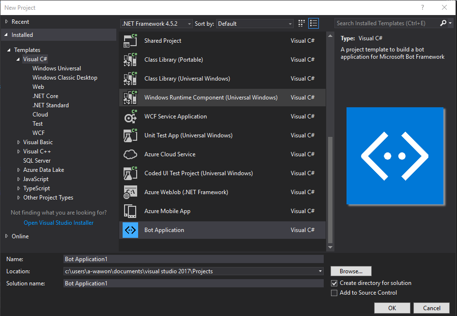
### 2.2. Right click solution explorer to update all packages in "Manage NuGet Packages"
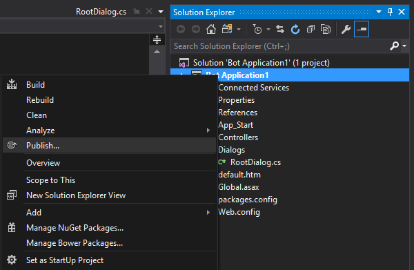
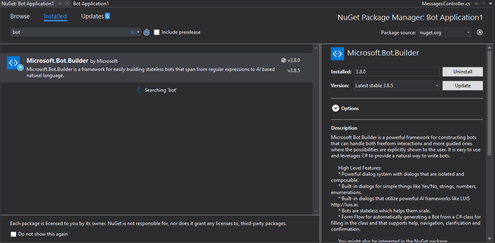
### 2.3. Download and install Bot Framework Emulator
###### Download emulator from: https://github.com/Microsoft/BotFramework-Emulator/releases/tag/v3.5.29
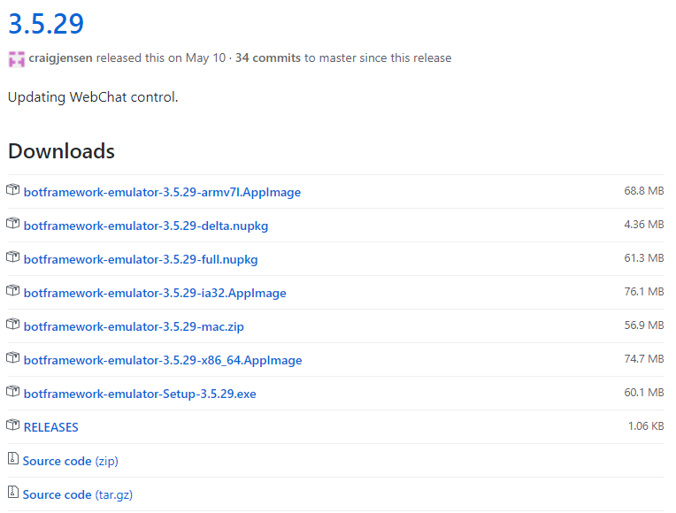
### 2.4. Debug and test the Bot
###### Debug the Bot Application in Visual Studio
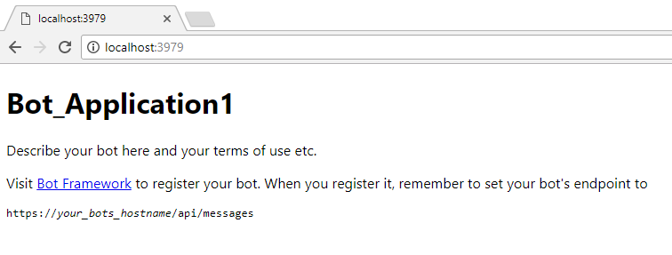
###### Check the hostname and port number from the internet explorer and put it into Bot Framework Emulator
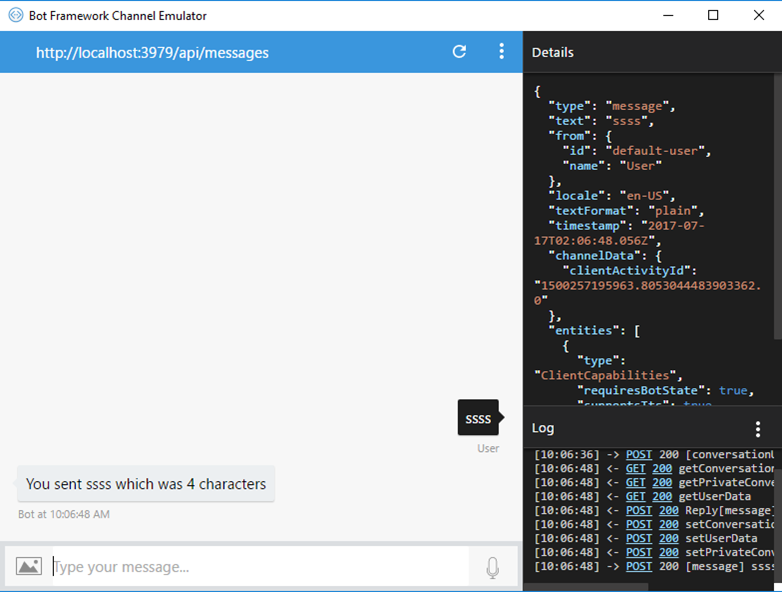
###### Then test if the bot can response or not
---
## 3. Publish the Bot Application to Azure
### 3.1. Right click solution explorer to click "Publish"

### 3.2. Publish as Microsoft Azure App Service
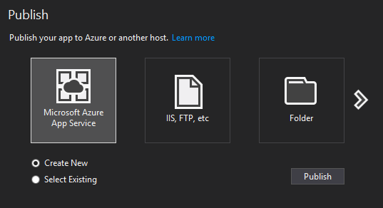
### 3.3. Name the App name, select resource group and, App service plan and publish
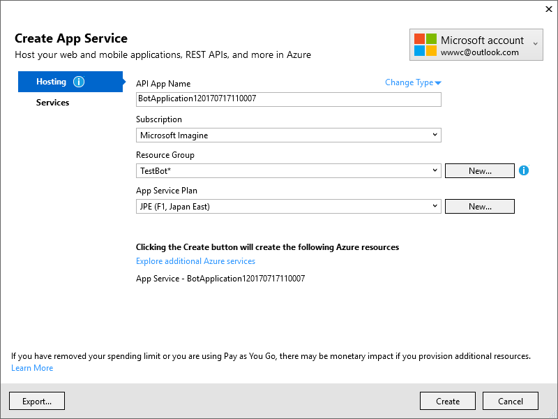
###### If it is published successfully, Internet explorer will show the App url
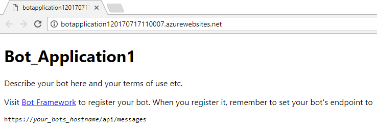
### 3.4. Manage your Bot Application in Azure portal
###### Go to: https://portal.azure.com/
###### Click into the Bot Application and check the details
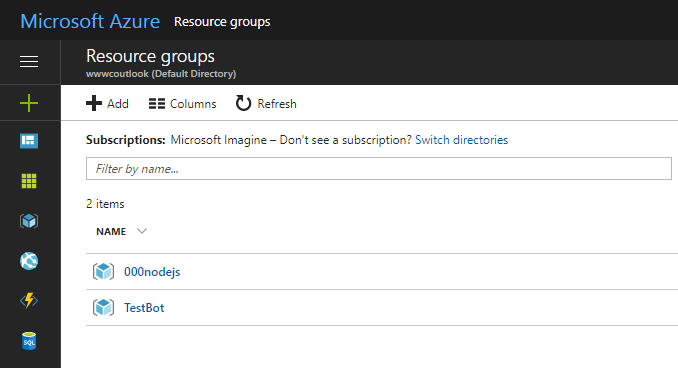
---
## 4. Connect the Bot Application to Skype and Telegram
### 4.1. Register a bot
###### Go to https://dev.botframework.com/ and register a bot
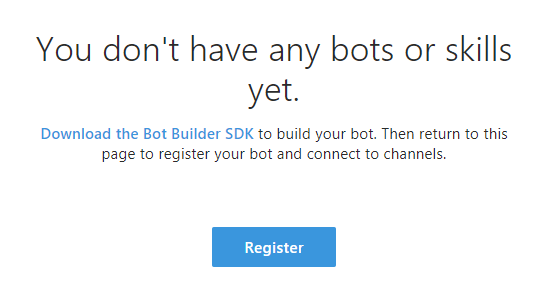
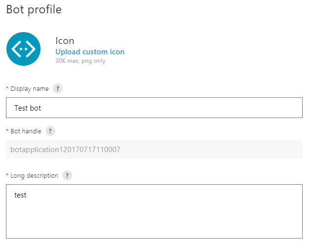
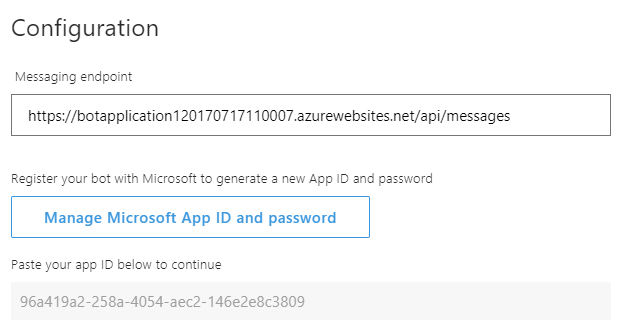
###### ***Mark down the App ID and Password
### 4.2. Input the App ID and Password into Bot Application/web.config
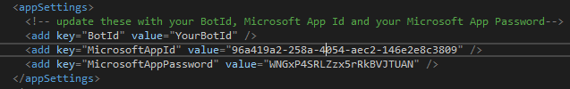
### 4.3. Publish the Bot Application from Visual Studio again

### 4.4. Test it from the Bot Framework Web
###### Go to https://dev.botframework.com/ and test if the bot can response or not
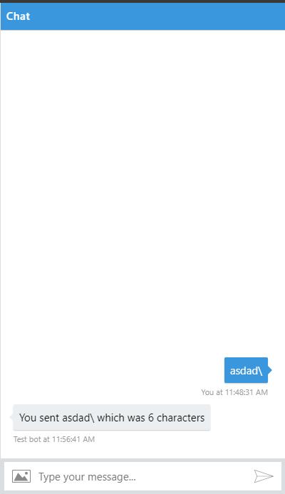
### 4.5. Click "Skype" in your channel

### 4.6. Add the BOt into your skype contact

### 4.7. Register a new Bot from Telegram
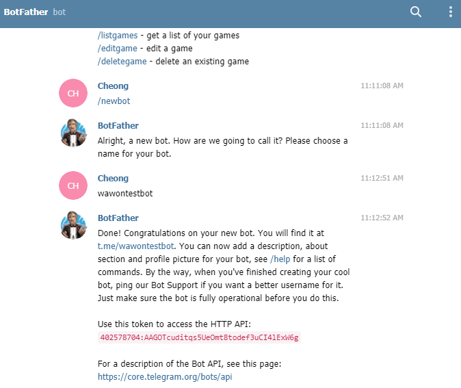
###### 4.7.1. Find BotFather in Telegram
###### 4.7.2. Enter the Telegram Bot name
###### 4.7.3. Copy the token
### 4.8. Add Telegram Channel from the Bot Application
###### Go to https://dev.botframework.com/ and select the Bot. Then add a Telegram channel
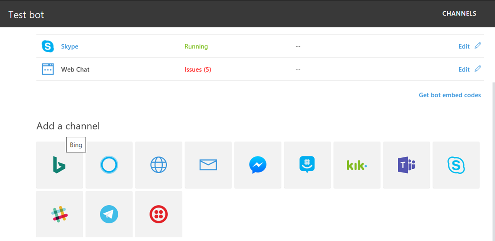
###### Enter the token from Telegram
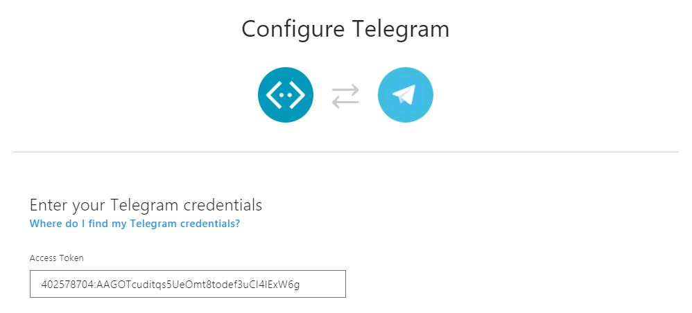
### 4.9. Find your Bot and test it
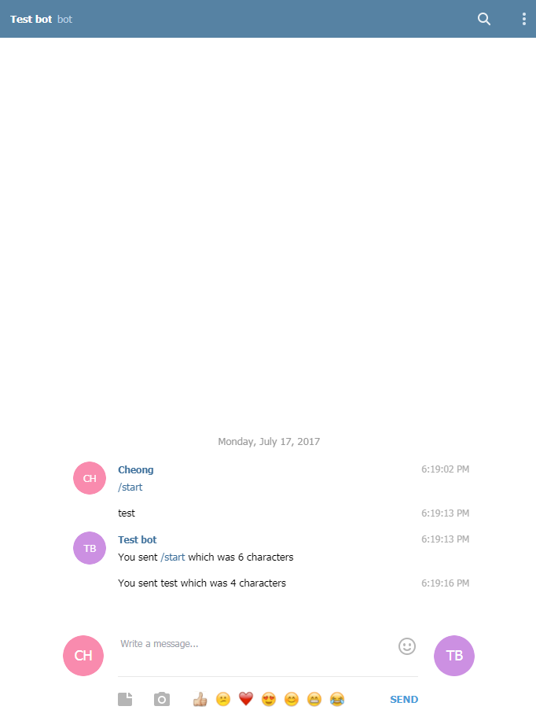

